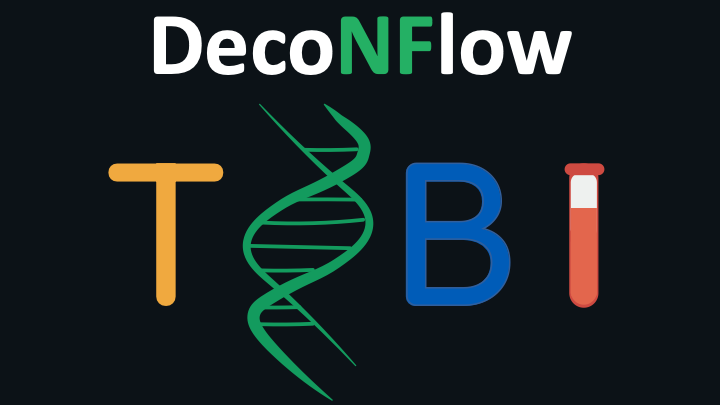

[](https://www.nextflow.io/)
[](https://www.docker.com/)
[](https://sylabs.io/docs/)
[](https://github.com/askimed/nf-test)

# Introduction

DecoNFlow is a bioinformatics analysis pipeline used for computational deconvolution of DNA methylation data. It allows deconvolution of samples using both reference-based and reference-free deconvolution tools. It also allows benchmarking of the different tools included in the pipeline.

The pipeline is built using [Nextflow](https://www.nextflow.io/) (>=23.04.0) a workflow tool to run tasks across multiple compute infrastructures in a very portable manner. It uses Docker / Singularity containers making installation trivial and results highly reproducible.

# Pipeline Summary


The pipeline allows you to run both reference-based and reference-free deconvolution tools. The pipeline also allows you to choose among different differential methylated region (DMR) selection tools. Visit [docs](https://github.com/VIBTOBIlab/DecoNFlow/tree/main/docs/) for more information.

1. DMR selection
   1. DMRfinder
   2. limma
   3. wgbs_tools
2. Deconvolution
   1. Reference-based deconvolution
      - meth_atlas (.cov)
      - CIBERSORT (.cov)
      - EpiDISH (.cov)
      - Houseman's CP (equality)
      - Houseman's CP (inequality)
      - EpiSCORE (.cov)
      - MethylResolver (.cov)
      - PRMeth (.cov)
      - CelFiE (.cov)
      - MetDecode (.cov)
      - UXM (.bam)
   2. Reference-free deconvolution
      - MeDeCom (.cov)
      - RefFreeCellMix (.cov)

# Usage

> **NOTE**
> If you are new to Nextflow and nf-core, please refer to [this page](https://nf-co.re/docs/usage/getting_started/installation) on how to set-up Nextflow.

## Bulk samples

First, prepare a samplesheet (.csv) file with your samples that need to be deconvolved as follows:

`test.csv`:

```plaintext:
name,sample
test1,/path/to/the/files/file1.cov.gz
test2,/path/to/the/files/file2.cov.gz
test3,/path/to/the/files/file3.cov.gz
test4,/path/to/the/files/file4.cov.gz
```

Each row represents a sample, defined by a name (first column) and the sample path to the coverage file (second column).

## Reference samples

> **NOTE** This step can be skipped if no reference samples are available, or if you want to run reference-free deconvolution tools. For more information, please refer to the [docs](https://github.com/VIBTOBIlab/DecoNFlow/tree/main/docs/README.md).

Finally, prepare a samplesheet with your reference samples to build the reference matrix. This step is necessary if you want to use reference-based deconvolution tools. The file looks as follows:

`reference.csv`

```plaintext:
name,type,file
file1,healthy,/path/to/the/file/file1.cov.gz
file2,healthy,/path/to/the/file/file2.cov.gz
file3,healthy,/path/to/the/file/file3.cov.gz
file4,nbl,/path/to/the/file/file4.cov.gz
file5,nbl,/path/to/the/file/file5.cov.gz
file6,nbl,/path/to/the/file/file6.cov.gz
```

Each row represents a coverage file, with the first column representing the sample name, the second column representing the name of the cell type and the last column representing the path where the coverage file is stored.

## Run the pipeline

> **NOTE** For more information, please refer to the [docs](https://github.com/VIBTOBIlab/DecoNFlow/tree/main/docs/README.md).

Now you can run the NextFlow (>=23.10.1) pipeline. You need to allocate at least 8 CPUs and 16 GB of RAM to make the pipeline running. When running the pipeline, you need to specify the at least one deconvolution tool to use (e.g. `--meth_atlas`). If you specify a reference-based deconvolution tool, also a DMR selection approach needs to be specified (e.g. `--DMRselection DMRfinder`). The pipeline can also be run using the flag `--benchmark`. In this case, it will run all the tools included in the pipeline, however several files need to be specified (please refer to the [documentation](./docs/usage.md)). If you want to run the pipeline using UXM, refer to the [documentation](https://github.com/VIBTOBIlab/DecoNFlow/tree/main/docs/usage.md).

You can run the pipeline using docker profile:

```plaintext:
nextflow run main.nf -params-file params.yaml -profile docker
```

Or using singularity profile:

```plaintext:
nextflow run main.nf -params-file params.yaml -profile singularity
```

The params.yaml file looks like the following:

`params.yaml`:

```plaintext:
input: ./resources/reference.csv
output_dir: ./results
test_samples: ./resources/test.csv
meth_atlas: true
DMRselection: DMRfinder
```

All the parameters specified in the file can also be specified in the command line using the corresponding flags.

# Credits

The scripts and containers have been written and built by Edoardo Giuili ([@edogiuili](https://github.com/edogiuili)), Maísa Santos([@mferrodo](https://github.com/mferrodo)) and Sofie Van de Velde ([@sofvdvel](https://github.com/sofvdvel)), who are also the maintainers.

# Citations

If you use this pipeline for your analysis, please cite it using the following doi: (...).
You can cite the nf-core publication as follows:

> The nf-core framework for community-curated bioinformatics pipelines.
>
> Philip Ewels, Alexander Peltzer, Sven Fillinger, Harshil Patel, Johannes Alneberg, Andreas Wilm, Maxime Ulysse Garcia, Paolo Di Tommaso & Sven Nahnsen.
>
> Nat Biotechnol. 2020 Feb 13. doi: [10.1038/s41587-020-0439-x](https://www.nature.com/articles/s41587-020-0439-x).
